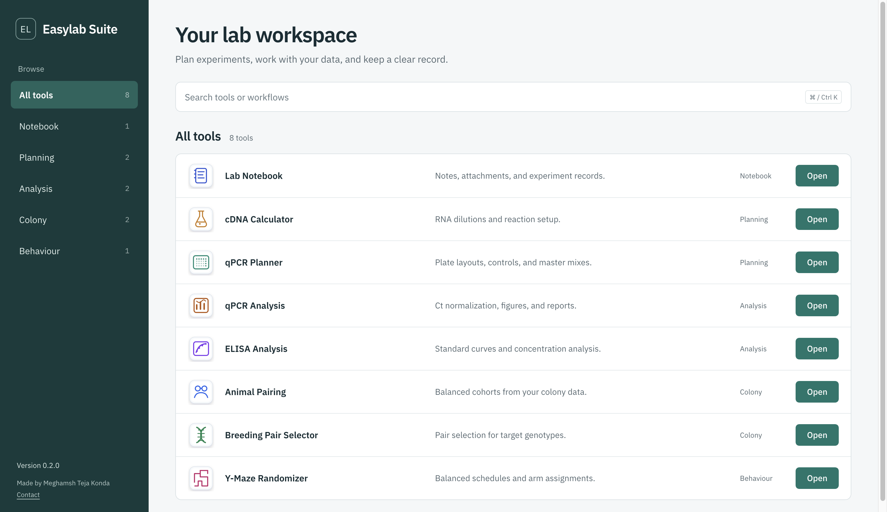
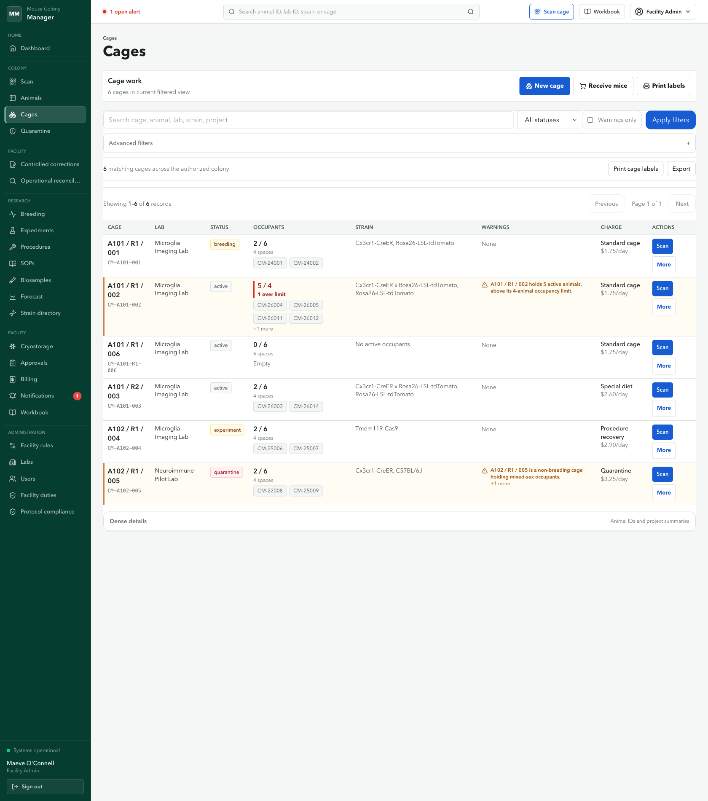
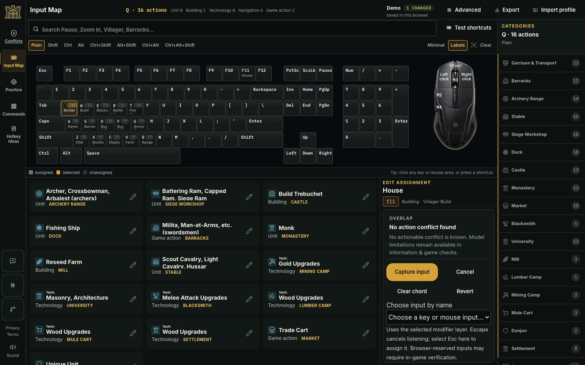
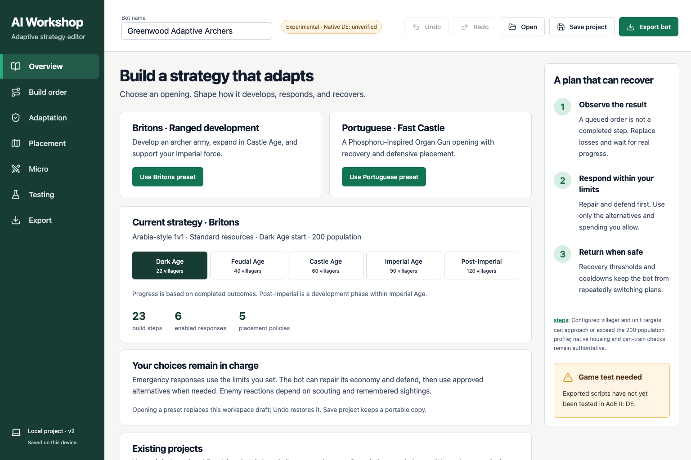
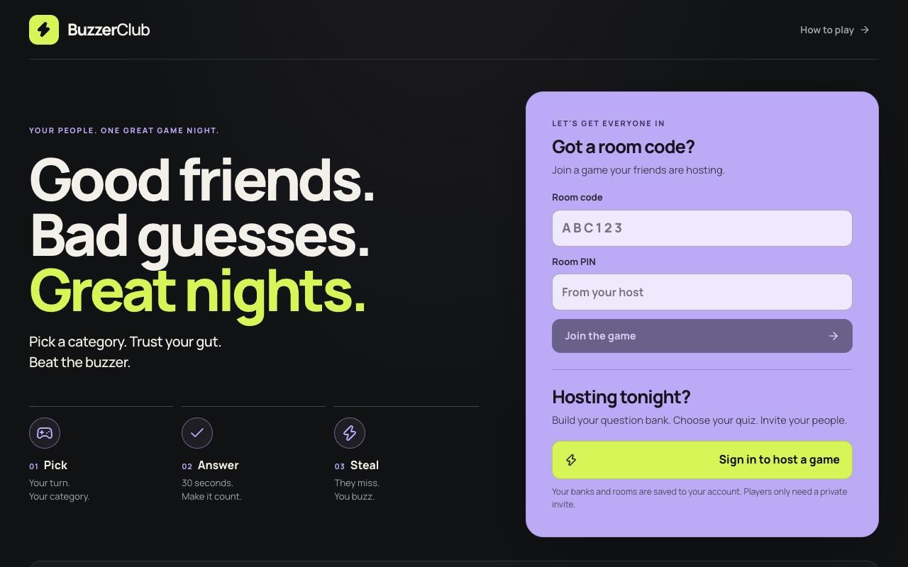

# Meghamsh Teja Konda

**PhD researcher in neuroimmunology at Trinity College Dublin.**

I study brain–immune interactions in ageing and build practical software for research workflows, image analysis and play.

[Portfolio](https://meghamsh738.github.io/Website/) · [GitHub repositories](https://github.com/meghamsh738?tab=repositories)

## Research

I am a PhD researcher in neuroimmunology at Trinity College Dublin. My current research focus concerns systemic TNF-α-driven neuroinflammation, delirium vulnerability in ageing, recovery dynamics and IL-17A modulation, as listed in the [2026 TCD Neuroscience Research Day programme](https://www.tcd.ie/Neuroscience/assets/PDF/Neuroscience%20Research%20Day%202026%20-%20Programme.pdf).

## Publication

[“CSF1R inhibition exacerbates gamma oscillation disruption and induces network hyperexcitability in APP/PS1 mice”](https://doi.org/10.1093/brain/awag147), *Brain*, published online 14 July 2026. Meghamsh Konda is credited as the fifth of 11 authors.

## Selected projects

### [AtlasAlign](https://github.com/meghamsh738/atlasalign)

A Fiji workflow for atlas-guided tissue alignment and ROI drawing. A recorded native checkpoint reached the Interior editor, but did not accept an alignment, create ROIs or export results.

**In progress · native acceptance, ROI and export steps pending**

[View repository](https://github.com/meghamsh738/atlasalign)
### [EasyLab Suite](https://github.com/meghamsh738/EasyLab-suite)

An eight-module lab workspace for qPCR planning and analysis, cDNA setup, ELISA, colony workflows, Y-maze schedules and a Lab Notebook entry point.

**Review build · v0.2.0; source branch six commits ahead of main**

[View repository](https://github.com/meghamsh738/EasyLab-suite)
### [Mouse Colony Manager](https://github.com/meghamsh738/Mouse-colony-manager)

A Next.js and Prisma app for cage-first colony operations and animal-first research workflows. The gallery shows an isolated synthetic local prototype.

**Local M16-based synthetic cage create/reload checked; release and M17 pending**

[View repository](https://github.com/meghamsh738/Mouse-colony-manager)
### [AoE2 Hotkey Editor](https://github.com/meghamsh738/aoe2-hotkey-editor-demo)

A browser editor for inspecting and editing Age of Empires II hotkey profiles, with local browser drafts and a synthetic demo.

**Build C public demo · synthetic import/edit/reload/ZIP re-import checked; game behavior unverified**

[Open public demo](https://meghamsh738.github.io/aoe2-hotkey-editor-demo/) · [View compiled demo repository](https://github.com/meghamsh738/aoe2-hotkey-editor-demo)
### [Adaptive AI Workshop](https://meghamsh738.github.io/Aoe2-AI-editor/)

A visual editor for building and adapting Age of Empires II strategy plans, with controls for responses and placement policies.

**Experimental · public Pages demo live; native game behavior unverified**

[Open live editor](https://meghamsh738.github.io/Aoe2-AI-editor/) · [View repository](https://github.com/meghamsh738/Aoe2-AI-editor)
### [Buzzer Club](https://meghamsh738.github.io/buzzer-club/)

A hosted quiz-night game with room-code and PIN entry, category picks, a 30-second answer step and a steal round.

**Version 12 · single-player flow checked; multiplayer behavior unverified**

[Open showcase](https://meghamsh738.github.io/buzzer-club/) · [Play Buzzer Club](https://buzzer-club-jeopardy.xpertthuggaming.chatgpt.site/)

## Methods & tools

**Experimental:** mouse handling, stereotaxic surgery, microdissection, behavioural assays and colony work.

**Cell, imaging & molecular:** flow cytometry, immunofluorescence, confocal microscopy, cell culture, Cre-loxP lineage tracing, qPCR, PCR, RNA/protein extraction, Western blotting and primer design.

**Analysis & software:** Python, R, ImageJ/Fiji, Imaris, FlowJo, Leica LAS X, GraphPad Prism and AnyMaze.

---

Project cards and representative screenshots are generated from data/project-catalog.json (catalog update: 2026-10-04). See the [portfolio](https://meghamsh738.github.io/Website/) for the current screenshots and verification notes.
